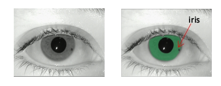

# IrisSegBenchmark

### Introduction
This repository contains some codes for **iris segmentation**. 

### CNN models
The used models includes:
- [FCN](https://arxiv.org/abs/1411.4038)
- [Deeplab V1,V2,V3](http://liangchiehchen.com/projects/DeepLab.html)
- [ParseNet](https://arxiv.org/abs/1506.04579)
- [PSPNet](https://arxiv.org/abs/1612.01105)
- [SegNet](http://mi.eng.cam.ac.uk/projects/segnet/)
- [U-Net](https://arxiv.org/abs/1505.04597)

We use the [extended caffe](https://github.com/xiamenwcy/extended-caffe) to implement these models.

If you want to train your model, you can use the data from  [IrisParseNet](https://github.com/xiamenwcy/IrisParseNet)

The trained model can be downloaded via https://pan.baidu.com/s/1t0fSgVZKzSGtAcQhVEP8jg       . 

### Traditional methods
- TVM: [https://www4.comp.polyu.edu.hk/~csajaykr/tvmiris.htm](https://www4.comp.polyu.edu.hk/~csajaykr/tvmiris.htm)
-  PRL_Haindl_Krupicka: [Unsupervised detection of non-iris occlusions](https://www.sciencedirect.com/science/article/pii/S0167865515000604) , [code](https://ars.els-cdn.com/content/image/1-s2.0-S0167865515000604-mmc1.zip)

### Evaluation protocols
  please see [IrisParseNet](https://github.com/xiamenwcy/IrisParseNet)

### Questions
Please contact wangcaiyong2017@ia.ac.cn

